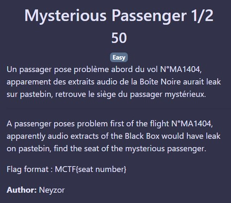

# Mysterious Passenger 1/2

## Énoncé :

Un passager pose problème abord du vol N°MA1404, apparement des extraits audio de la Boîte Noire aurait leak sur pastebin, retrouve le siège du passager mystérieux.

En recherchant MA1404 sur Pastebin, nous trouvons bien des extraits audio de la boîte Noire

Un des fichiers audio possède un passage qui a été acceleré, en le ralentissant nous entendons : 

"Un passager nous pose problème au siège 61 B"

Flag: MCTF{61B}
