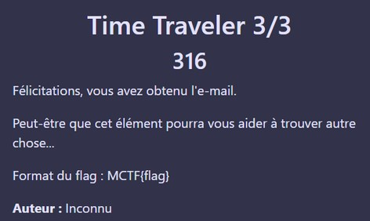
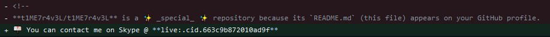
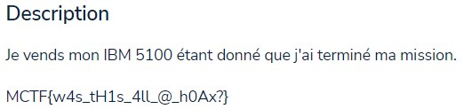

# Time Traveler [3/3]

Epieos nous indique que l'adresse email a été utilisée pour un compte GitHub

GitHub que nous trouvons grâce a GitFive
https://github.com/t1ME7r4v3L/t1ME7r4v3L

Dans les commits du GitHub, nous apercevons un lien Skype

En l'ajoutant sur Skype, sa bio indique qu'il vend un IBM 5100, ce qui correspond à cette annonce sur leboncoin : https://www.leboncoin.fr/informatique/2332710987.htm

Flag : MCTF{w4s*tH1s_4ll*@\_h0Ax?}
